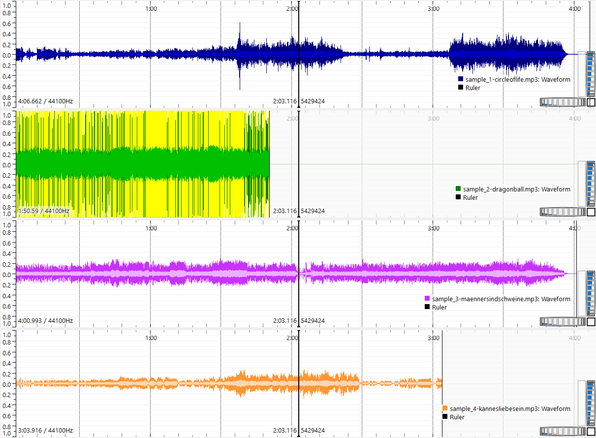

# Loudness Normalisierungstest

1. Füge Lieder (mp3-Dateien) mit unterschiedlicher empfundener Lautstärke in `./input`-Verzeichnis ein
2. Skript ausführen

    ``` py
    python norm.py
    ```

3. Vergleiche Konvertierte Musikdateien in `./dual_norm` und `simple_norm`, wo die Lautstärke eher ähnlich laut wirkt

## Manueller 2-stufiger Test

input



linear


- [wiki.tnonline.net - Audio normalization with ffmpeg](https://wiki.tnonline.net/w/Blog/Audio_normalization_with_FFmpeg)

  > `i=` Set integrated loudness target. Range is -70.0 - -5.0. Default value is -24.0. For __EBU R128__ normalization a target of __-23dB__ should be used.
  > `lra=` Set loudness range target. Range is 1.0 - 20.0. Default value is 7.0.
  > `tp=` Set maximum true peak. Range is -9.0 - +0.0. Default value is -2.0. 

- [sound.stackexchange.com - Linear loudness normalization in FFMPEG is in fact dynamic](https://sound.stackexchange.com/questions/49980/linear-loudness-normalization-in-ffmpeg-is-in-fact-dynamic)

  > - measured_I, measured_LRA, measured_TP, and measured_thresh must all be specified.
  > - Target LRA shouldn’t be lower than source LRA and
  > - the change in integrated loudness shouldn’t result in a true peak which exceeds the target TP. If any of these conditions aren’t met, normalization mode will revert to dynamic.

- [Bytes And Bones - Audio normalization with ffmpeg using loudnorm (ebur128) filter](https://bytesandbones.wordpress.com/2017/03/16/audio-nomalization-with-ffmpeg-using-loudnorm-ebur128-filter/)

### Vorgangsweise

``` ps1
mkdir linear
```

1. Bestimme Werte (ohne Datei-Ausgabe)

    ``` ps1
    ffmpeg -i .\input\sample_1-circleoflife.mp3 -af loudnorm=I=-23:TP=-2.0:LRA=7.0:print_format=summary -f null -
    ```

    `I`, `TP` und `LRA` hier immer mit gleichem (Default)-Wert laut [wiki.tnonline.net - Audio normalization with ffmpeg](https://wiki.tnonline.net/w/Blog/Audio_normalization_with_FFmpeg)

2. Test-Ausgabe mit gemessenen Werten

    ``` ps1
    ffmpeg -i .\input\sample_1-circleoflife.mp3 -af loudnorm=I=-23:TP=-2.0:LRA=7.0:measured_I=-24.0:measured_TP=-3.4:measured_LRA=16.2:measured_thresh=-35.2:offset=-1:linear=true:print_format=summary -f null -
    ```

    Sofern die vorletzte Zeile `Dynamic` lautet, als `LRA` statt dem Default von `7.0` den aufgerundeten Wert von `Input LRA` verwenden, bei `Linear` allerdings mit Schritt 3. fortfahren

    ``` ps1
    ffmpeg -i .\input\sample_1-circleoflife.mp3 -af loudnorm=I=-23:TP=-2.0:LRA=17:measured_I=-24.0:measured_TP=-3.4:measured_LRA=16.2:measured_thresh=-35.2:offset=-1:linear=true:print_format=summary -f null -
    ```

    Nun sollte `Linear` stehen

3. Ausgabe durch verwenden der Werte aus Schritt 2, bei denen `Linear` in der Ausgabe stand

    ``` ps1
    ffmpeg -i .\input\sample_1-circleoflife.mp3 -af loudnorm=I=-23:TP=-2.0:LRA=17:measured_I=-24.0:measured_TP=-3.4:measured_LRA=16.2:measured_thresh=-35.2:offset=-1:linear=true ./linear/sample_1-circleoflife.mp3
    ```

### sample_1

``` ps1
ffmpeg -i .\input\sample_1-circleoflife.mp3 -af loudnorm=I=-23:TP=-2.0:LRA=7.0:print_format=summary -f null -
# Input Integrated:    -24.0 LUFS
# Input True Peak:      -3.4 dBTP
# Input LRA:            16.2 LU
# Input Threshold:     -35.2 LUFS
#
# Output Integrated:   -22.0 LUFS
# Output True Peak:     -2.0 dBTP
# Output LRA:            8.1 LU
# Output Threshold:    -32.2 LUFS
#
# Normalization Type:   Dynamic
# Target Offset:        -1.0 LU
```

2nd run

``` ps1
ffmpeg -i .\input\sample_1-circleoflife.mp3 -af loudnorm=I=-23:TP=-2.0:LRA=7.0:measured_I=-24.0:measured_TP=-3.4:measured_LRA=16.2:measured_thresh=-35.2:offset=-1:linear=true ./linear/sample_1-circleoflife.mp3
```

validate

``` ps1
ffmpeg -i .\input\sample_1-circleoflife.mp3 -af loudnorm=I=-23:TP=-2.0:LRA=7.0:measured_I=-24.0:measured_TP=-3.4:measured_LRA=16.2:measured_thresh=-35.2:offset=-1:linear=true:print_format=summary -f null -
# Input Integrated:    -24.0 LUFS
# Input True Peak:      -3.4 dBTP
# Input LRA:            16.2 LU
# Input Threshold:     -35.2 LUFS
#
# Output Integrated:   -23.0 LUFS
# Output True Peak:     -3.0 dBTP
# Output LRA:            8.1 LU
# Output Threshold:    -33.2 LUFS
#
# Normalization Type:   Dynamic
# Target Offset:        +0.0 LU
```

__improved__ `LRA=17`

``` ps1
ffmpeg -i .\input\sample_1-circleoflife.mp3 -af loudnorm=I=-23:TP=-2.0:LRA=17:measured_I=-24.0:measured_TP=-3.4:measured_LRA=16.2:measured_thresh=-35.2:offset=-1:linear=true:print_format=summary -f null -
# Input Integrated:    -24.0 LUFS
# Input True Peak:      -3.5 dBTP
# Input LRA:            16.2 LU
# Input Threshold:     -35.2 LUFS
#
# Output Integrated:   -23.0 LUFS
# Output True Peak:     -2.5 dBTP
# Output LRA:           16.2 LU
# Output Threshold:    -34.2 LUFS
#
# Normalization Type:   Linear
# Target Offset:        -0.0 LU

ffmpeg -i .\input\sample_1-circleoflife.mp3 -af loudnorm=I=-23:TP=-2.0:LRA=17:measured_I=-24.0:measured_TP=-3.4:measured_LRA=16.2:measured_thresh=-35.2:offset=-1:linear=true ./linear/sample_1-circleoflife.mp3
```

### sample_2

``` ps1
ffmpeg -i .\input\sample_2-dragonball.mp3 -af loudnorm=I=-23:TP=-2.0:LRA=7.0:print_format=summary -f null -
# Input Integrated:     -7.1 LUFS
# Input True Peak:      +3.8 dBTP
# Input LRA:             3.0 LU
# Input Threshold:     -17.1 LUFS
#
# Output Integrated:   -22.6 LUFS
# Output True Peak:    -10.1 dBTP
# Output LRA:            2.5 LU
# Output Threshold:    -32.6 LUFS
#
# Normalization Type:   Dynamic
# Target Offset:        -0.4 LU
```

2nd run

``` ps1
ffmpeg -i .\input\sample_2-dragonball.mp3 -af loudnorm=I=-23:TP=-2.0:LRA=7.0:measured_I=-7.1:measured_TP=3.8:measured_LRA=3.0:measured_thresh=-17.1:offset=-0.4:linear=true ./linear/sample_2-dragonball.mp3
```

validiere

``` ps1
ffmpeg -i .\input\sample_2-dragonball.mp3 -af loudnorm=I=-23:TP=-2.0:LRA=7.0:measured_I=-7.1:measured_TP=3.8:measured_LRA=3.0:measured_thresh=-17.1:offset=-0.4:linear=true:print_format=summary -f null -
# Input Integrated:     -7.0 LUFS
# Input True Peak:      +3.8 dBTP
# Input LRA:             2.9 LU
# Input Threshold:     -17.1 LUFS
#
# Output Integrated:   -22.9 LUFS
# Output True Peak:    -12.1 dBTP
# Output LRA:            2.9 LU
# Output Threshold:    -33.0 LUFS
#
# Normalization Type:   Linear
# Target Offset:        -0.1 LU
```

### sample_3

``` ps1
ffmpeg -i .\input\sample_3-maennersindschweine.mp3 -af loudnorm=I=-23:TP=-2.0:LRA=7.0:print_format=summary -f null -
# Input Integrated:    -23.9 LUFS
# Input True Peak:     -10.4 dBTP
# Input LRA:             6.2 LU
# Input Threshold:     -34.1 LUFS
#
# Output Integrated:   -22.3 LUFS
# Output True Peak:     -8.3 dBTP
# Output LRA:            5.3 LU
# Output Threshold:    -32.5 LUFS
#
# Normalization Type:   Dynamic
# Target Offset:        -0.7 LU
```

2nd run

``` ps1
ffmpeg -i .\input\sample_3-maennersindschweine.mp3 -af loudnorm=I=-23:TP=-2.0:LRA=7.0:measured_I=-23.9:measured_TP=-10.4:measured_LRA=6.2:measured_thresh=-34.1:offset=-0.7:linear=true ./linear/sample_3-maennersindschweine.mp3
```

validiere

``` ps1
ffmpeg -i .\input\sample_3-maennersindschweine.mp3 -af loudnorm=I=-23:TP=-2.0:LRA=7.0:measured_I=-23.9:measured_TP=-10.4:measured_LRA=6.2:measured_thresh=-34.1:offset=-0.7:linear=true:print_format=summary -f null -
# Input Integrated:    -23.9 LUFS
# Input True Peak:     -10.5 dBTP
# Input LRA:             6.3 LU
# Input Threshold:     -34.0 LUFS
#
# Output Integrated:   -23.0 LUFS
# Output True Peak:     -9.6 dBTP
# Output LRA:            6.3 LU
# Output Threshold:    -33.1 LUFS
#
# Normalization Type:   Linear
# Target Offset:        +0.0 LU
```

### sample_4

``` ps1
ffmpeg -i .\input\sample_4-kannesliebesein.mp3 -af loudnorm=I=-23:TP=-2.0:LRA=7.0:print_format=summary -f null -
# Input Integrated:    -27.1 LUFS
# Input True Peak:     -10.6 dBTP
# Input LRA:            13.9 LU
# Input Threshold:     -37.8 LUFS
#
# Output Integrated:   -21.3 LUFS
# Output True Peak:     -2.8 dBTP
# Output LRA:            7.4 LU
# Output Threshold:    -31.6 LUFS
#
# Normalization Type:   Dynamic
# Target Offset:        -1.7 LU
```

2nd run

``` ps1
ffmpeg -i .\input\sample_4-kannesliebesein.mp3 -af loudnorm=I=-23:TP=-2.0:LRA=7.0:measured_I=-27.1:measured_TP=-10.6:measured_LRA=13.9:measured_thresh=-37.8:offset=-1.7:linear=true ./linear/sample_4-kannesliebesein.mp3
```

validate

``` ps1
ffmpeg -i .\input\sample_4-kannesliebesein.mp3 -af loudnorm=I=-23:TP=-2.0:LRA=7.0:measured_I=-27.1:measured_TP=-10.6:measured_LRA=13.9:measured_thresh=-37.8:offset=-1.7:linear=true:print_format=summary -f null -
# Input Integrated:    -27.1 LUFS
# Input True Peak:     -10.6 dBTP
# Input LRA:            13.9 LU
# Input Threshold:     -37.8 LUFS
#
# Output Integrated:   -23.2 LUFS
# Output True Peak:     -8.6 dBTP
# Output LRA:            8.9 LU
# Output Threshold:    -33.6 LUFS
#
# Normalization Type:   Dynamic
# Target Offset:        +0.2 LU
```

__improved__ `LRA=14`

``` ps1
ffmpeg -i .\input\sample_4-kannesliebesein.mp3 -af loudnorm=I=-23:TP=-2.0:LRA=14:measured_I=-27.1:measured_TP=-10.6:measured_LRA=13.9:measured_thresh=-37.8:offset=-1.7:linear=true:print_format=summary -f null -
# Input Integrated:    -27.1 LUFS
# Input True Peak:     -10.6 dBTP
# Input LRA:            13.9 LU
# Input Threshold:     -37.7 LUFS
#
# Output Integrated:   -23.0 LUFS
# Output True Peak:     -6.5 dBTP
# Output LRA:           13.9 LU
# Output Threshold:    -33.6 LUFS
#
# Normalization Type:   Linear
# Target Offset:        -0.0 LU

ffmpeg -i .\input\sample_4-kannesliebesein.mp3 -af loudnorm=I=-23:TP=-2.0:LRA=14:measured_I=-27.1:measured_TP=-10.6:measured_LRA=13.9:measured_thresh=-37.8:offset=-1.7:linear=true ./linear/sample_4-kannesliebesein.mp3
```
